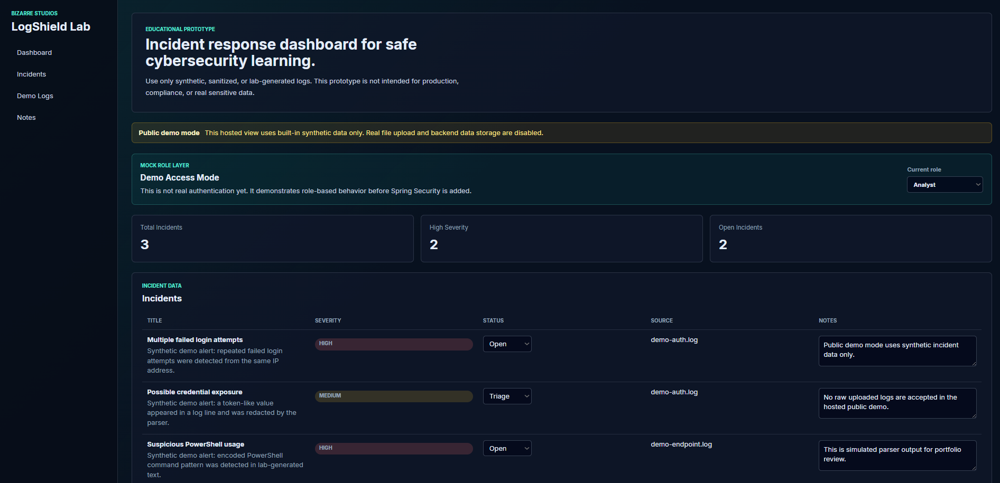
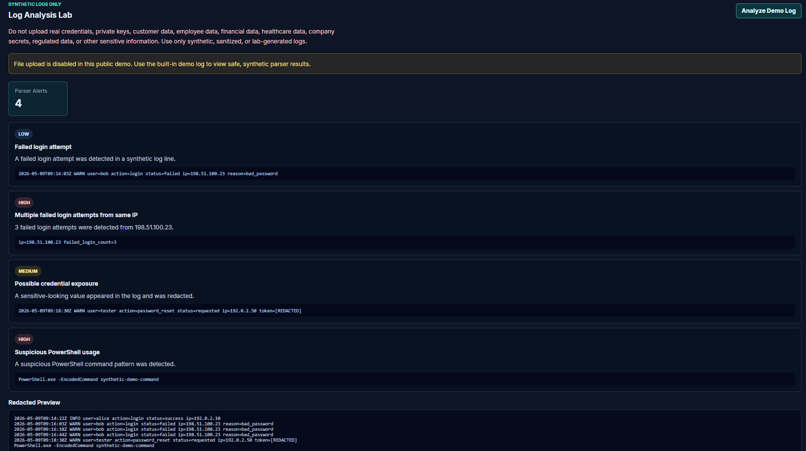

# LogShield Lab

**LogShield Lab** is a secure educational incident response dashboard built by Tyler Parrish under **Bizarre Studios**, a solo indie development brand.

> An educational prototype for portfolio and learning purposes only. It is not intended for production use, compliance use, or processing real sensitive, confidential, regulated, or personally identifiable information.

## Live Public Demo

```text
https://logshield-lab.vercel.app
```

The public demo is a frontend-only safe demo. It uses built-in synthetic data and does not accept real uploads.

## Screenshots

### Public Demo Dashboard



### Parser Results



## Architecture

See the architecture diagrams:

```text
docs/architecture/architecture-diagram.md
```

## Safety Notice

Do not upload real credentials, private keys, customer data, employee data, financial data, healthcare data, company secrets, regulated data, or other sensitive information. Use only synthetic, sanitized, or lab-generated logs.

LogShield Lab is not a real SOC platform, compliance product, enterprise security tool, or production monitoring system.

## Project Purpose

LogShield Lab demonstrates:

- Secure log file upload concepts
- Temporary parsing of uploaded logs
- Python-based log analysis
- Alert and incident generation
- Incident status tracking
- Analyst notes
- Basic role-based access concepts
- Privacy-conscious data handling
- Security-first design decisions

## Public Demo Mode

Public demo mode is designed for safe portfolio hosting.

In public demo mode:

- Real file uploads are disabled
- Backend API calls are disabled
- Database writes are disabled
- Parser service calls are simulated with built-in synthetic results
- Changes happen only in browser memory and reset on page reload

Run the public-safe demo locally from the frontend folder:

```powershell
npm run dev:demo
```

Build the public-safe static demo from the frontend folder:

```powershell
npm run build:demo
```

More details:

```text
docs/public-demo.md
```

## Local Full-Stack Architecture

```text
User opens browser
        ↓
React frontend dashboard
        ↓
Java Spring Boot backend API
        ↓
Python parser service
        ↓
PostgreSQL database
```

## Local Development Ports

```text
Frontend:
http://localhost:5173

Backend:
http://localhost:8080

Python parser service:
http://127.0.0.1:5000

Database:
Local PostgreSQL
```

## Tech Stack

- Frontend: React with TypeScript
- Backend: Java Spring Boot
- Parser Service: Python Flask
- Database: PostgreSQL
- Hosting: Vercel frontend-only public demo

## Project Structure

```text
logshield-lab/
├── frontend/
├── backend/
├── parser-service/
├── docs/
│   ├── architecture/
│   └── security/
├── sample-logs/
├── README.md
└── .gitignore
```

## Local Setup Requirements

Install:

- Git
- Node.js
- Java 17 or newer
- Python 3.12 or newer
- PostgreSQL
- VS Code

Check versions:

```powershell
git --version
node --version
npm --version
java --version
python --version
```

## Running the Public Demo Locally

From the project root:

```powershell
cd frontend
npm install
npm run dev:demo
```

Open:

```text
http://localhost:5173
```

## Running the Full Local Developer Version

The full local version uses three services.

### Terminal 1: Python Parser Service

Activate `.venv` only in this terminal:

```powershell
cd parser-service
.\.venv\Scripts\Activate.ps1
python app.py
```

When finished:

```powershell
deactivate
```

### Terminal 2: Spring Boot Backend

Set the PostgreSQL password for this terminal session:

```powershell
cd backend
$env:LOGSHIELD_DB_PASSWORD="your_postgres_password"
.\mvnw.cmd spring-boot:run
```

### Terminal 3: React Frontend

Do not activate `.venv` here:

```powershell
cd frontend
npm run dev
```

Open:

```text
http://localhost:5173
```

## PostgreSQL

Local database name:

```text
logshield_lab
```

The backend reads the database password from:

```text
LOGSHIELD_DB_PASSWORD
```

The password should not be committed to Git.

## Current Backend Endpoints

```text
GET   /api/health
GET   /api/incidents
PATCH /api/incidents/{id}/status
PATCH /api/incidents/{id}/notes
POST  /api/demo/analyze
POST  /api/upload/analyze
```

## Current Parser Endpoints

```text
GET  /health
POST /analyze
```

## Demo Roles

Current educational mock roles:

```text
ADMIN
ANALYST
VIEWER
```

This is not real authentication yet. It demonstrates role-based behavior before adding production-style authentication.

## Upload Safety

The local developer upload flow:

- Allows only `.txt`, `.log`, `.csv`, and `.json`
- Rejects empty files
- Enforces a 1 MB maximum file size
- Does not trust user filenames
- Does not expose upload paths
- Sends file text temporarily to the parser service
- Does not intentionally store raw uploaded logs long-term

For hosted public demos, real file upload should remain disabled.

## Development Phases

Completed:

- Phase 1: Project setup
- Phase 2: Backend MVP
- Phase 3: Python parser MVP
- Phase 4: Frontend MVP
- Phase 5: Secure upload handling
- Phase 6: PostgreSQL persistence
- Phase 7: Mock authentication and roles
- Public-safe hosted demo mode

Next:

- Phase 8: Portfolio polish

## Documentation

```text
docs/public-demo.md
docs/architecture/phase-1-setup-notes.md
docs/architecture/phase-2-backend-mvp-notes.md
docs/architecture/phase-3-parser-mvp-notes.md
docs/architecture/phase-4-frontend-mvp-notes.md
docs/architecture/phase-6-postgresql-notes.md
docs/security/phase-5-demo-analysis-notes.md
docs/security/phase-7-auth-roles-notes.md
docs/security/threat-model.md
docs/demo-walkthrough.md
```

## Status

Current status: local full-stack educational prototype plus public-safe frontend demo.
