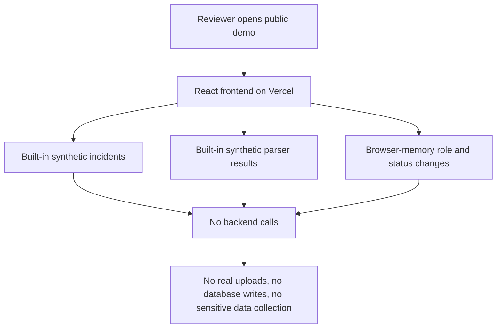
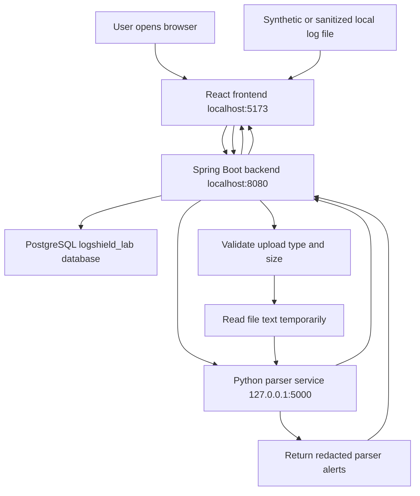
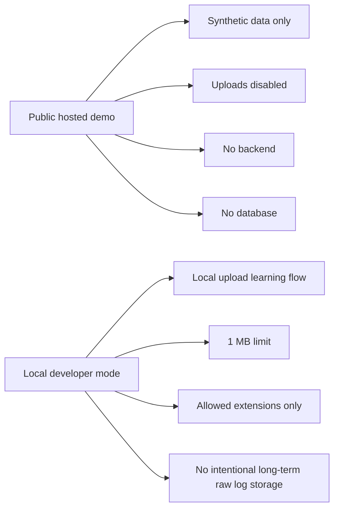

# LogShield Lab Architecture Diagram

## Public Demo Mode

The hosted public demo is intentionally frontend-only.

## Local Developer Mode

The local developer version runs the full educational stack.

## Safety Boundaries

## Notes

LogShield Lab is an educational prototype for portfolio and learning purposes only.

It is not intended for production use, compliance use, or processing real sensitive, confidential, regulated, or personally identifiable information.